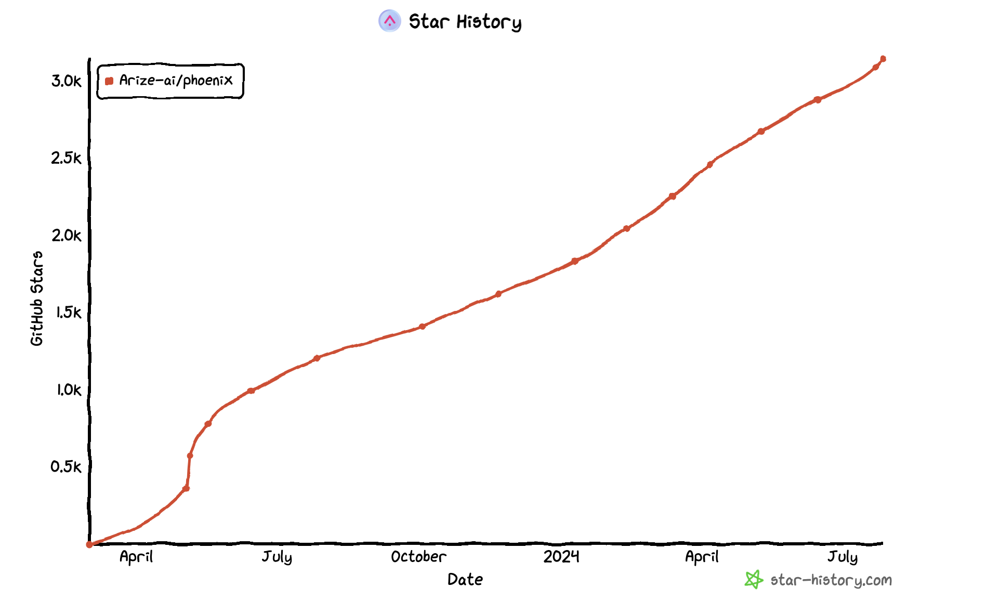
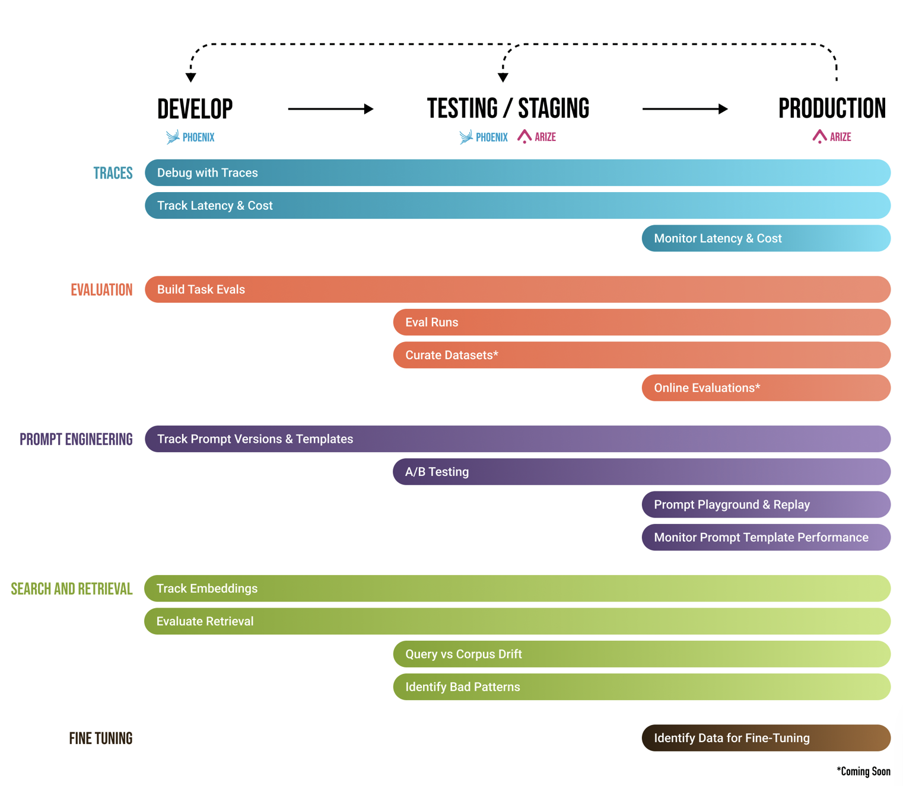
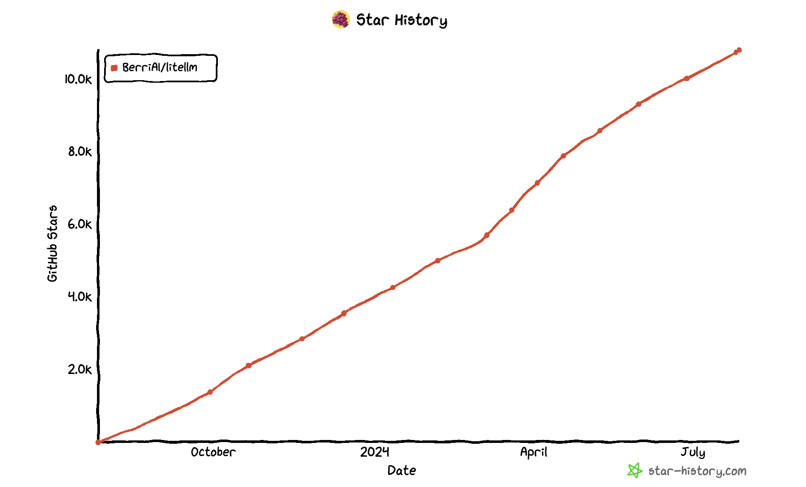
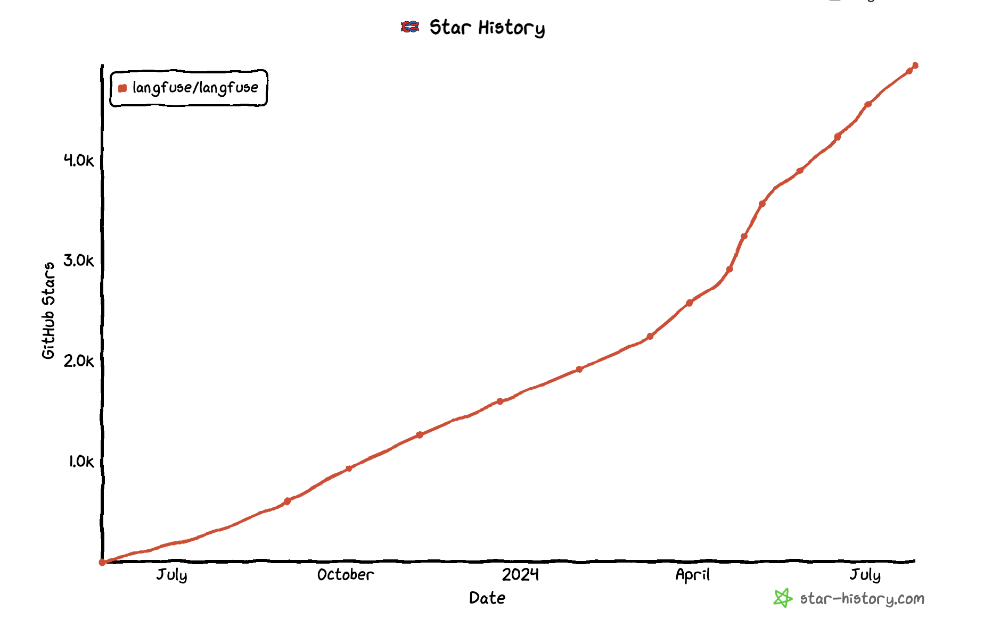
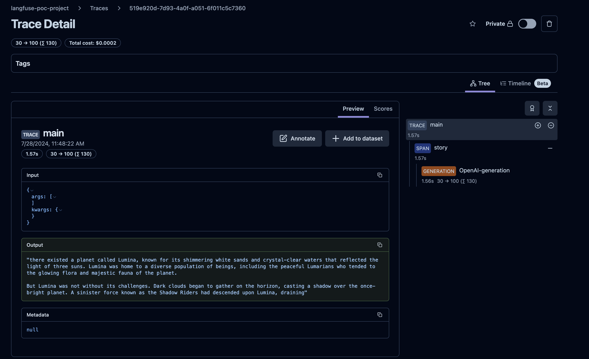
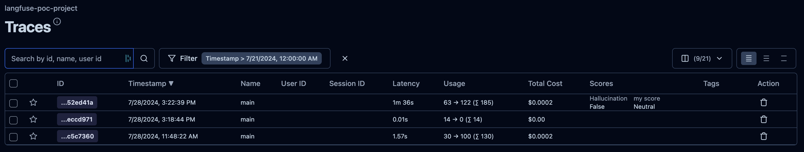
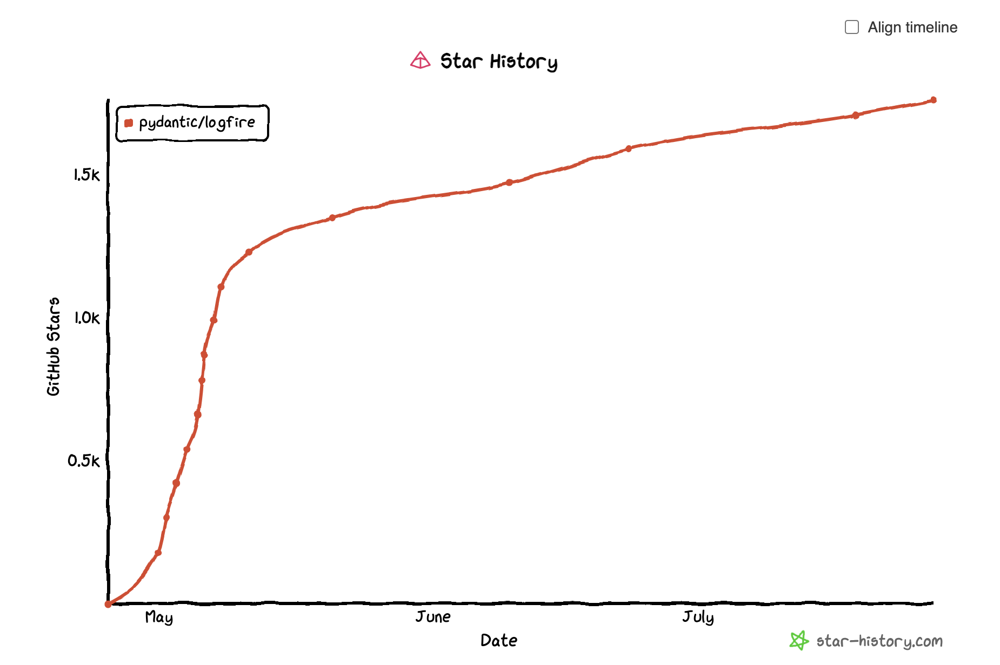

# LLM Proxy POC

This repo includes some notebooks and code to showcase the capabilities of various open source packages, 
that can be candidate to build a transparent proxy across various LLM vendors such as OpenAI, BedRock,..  

**Key functionality** of the packages being evaluated are:
 - LLM prompt and response **tracing**
 - Basic observability metrics **tracing** (latency, # of tokens used,...)
 - Dataset creation and Data **annotation** 
 - LLM Response **evaluation** leveraging other LLMs and golden datasets
 - SPA **UI** for easy review, annotation,... of the traces, datasets, evaluations,...
 - **Guardrail** to detect, quantify and mitigate the presence of specific types of risks (toxicity, PII, profanity, ...)
 - Ease of integration in consumer code - there should be no change to the LLM API code

**Nice to Have**:
 - leverage industry standards such as OpenTelemetry
 - Stack aligned with ours: hosting in `AWS`, back-end preferably in `python`, `containerized` and front-end preferably in `react.js`

**Out of Scope**:
 - providing a consistent interface across LLM vendors. It is a *transparent* proxy.

**Integration and Productization in the Cloud**:
 - First Integration will be with Azure OpenAI, then AWS BedRock. While we temporarily use sa `OPENAI_API_KEY` for POC, we wil be using a `Service Principal` instead when we productize
 - We will host the proxy in a highly available (99.99999%) and horizontal scaling cloud Envt, namely AWS (`EKS` or `ECS`)
 - We will be storing the traces in a DataStore that can store semi-structured data, namely traces, embeddings,... - a good candidate is `Aurora PostgreSQL` with its `pgvector` extension for storing embeddings. Aurora gives us massive throughput and highly concurrent workloads 
   - Why Aurora over RDS? Amazon Aurora is a good choice for mission-critical applications that require high availability and durability. It offers 99.999% availability and automatic failover. Amazon RDS can also be used for mission-critical applications, but it does not offer the same level of availability and durability as Amazon Aurora.


### Open Source candidates
 - [Arize Phoenix](#open-source-candidate-1---arize-phoenix) - Done (trace, eval and UI)
 - [Lite LLM](#open-source-candidate-2---litellm) - Done (proxy)
 - [Langfuse](#open-source-candidate-3---langfuse) - Done (trace, eval and UI)
 - [Lite LLM + Langfuse](#combining-2-open-source-candidates-litellm-proxy--langfuse) - To Do
 - [Logfire](#open-source-candidate-4---logfire) - To Do
 - [OpenLit](#open-source-candidate-5---openlit) - To Do
 - and more...

One idea would be to integrate `Lite LLM` proxy with one of the Tracing/Eval packages such as `Phoenix` or `Langfuse`
Here is an example of [python cookbook](https://langfuse.com/docs/integrations/litellm/example-proxy-python) to install both LLM Proxy and Langfuse: 

Here is a trend of the above open source candidates in regards to Github stars:  
  
There is a clear leader: `litellm`, but some like `langfuse` are getting more traction while others are steadily increasing which is a good sign.

| Package  | License | Procured | Stars | Proxy | Tracing | Evaluation | DataSets | Guardrail | Common interface to LLMs | Web Client | OTL compatible |
|:---------|:-------:|:--------:|:-----:|:-----:|:-------:|:----------:|:--------:|:---------:|:------------------------:|:----------:|:--------------:|
| Lite LLM |   MIT   |    Y     | 10.8k |   X   |    X    |     -      |    -     |     X     |            X             |     -      |       X        |
| Phoenix  |  ELv2   |    Y     | 3.1k  |   -   |    X    |     X      |    X     |    X**    |            -             |     X      |       X        |
| Langfuse |  MIT*   |    N     |  5k   |   -   |    X    |     X      |    X     |     ~     |            -             |     X      |       X        |
| Logfire  |   MIT   |    N     | 1.8k  |       |         |            |          |           |                          |            |                |
| OpenLit  | Apache  |    N     |  579  |       |         |            |          |           |                          |            |                |
| TBD      |         |          |       |       |         |            |          |           |                          |            |                |


X* Langfuse is under MOT license with the exception of the `/ee` and `/web/src/ee`
~ Langfuse integrates with multiple security libraries for leakage of PII info,, harmful prompts: LLM Guard, Prompt Armor, NeMo Guardrails, Microsoft Azure AI Content Safety, Lakera. 
X** Guardrail span kind added on 07/18 as part of `arize-phoenix v4.11.0`
---

#### Open Source Candidate #1 - Arize Phoenix

[Arize Phoenix](https://docs.arize.com/phoenix) ([Phoenix Github](https://github.com/Arize-ai/phoenix)) is an open-source AI observability platform designed for experimentation, 
evaluation, and troubleshooting. The license is Elastic License 2.0 (ELv2).  
The current # of stars is 3.1k as of July 2024 and it keeps increasing.  
  


It provides:
- Tracing - Trace your LLM application's runtime using OpenTelemetry-based instrumentation.
- Evaluation - Leverage LLMs to benchmark your application's performance using response and retrieval evals.
- Datasets - Create versioned datasets of examples for experimentation, evaluation, and fine-tuning.
- Experiments - Track and evaluate changes to prompts, LLMs, and retrieval.
- Inference Analysis - Visualize inferences and embeddings using dimensionality reduction and clustering to identify drift and performance degradation.

It is currently procured and available in our private jFrog artifactory: `litellm-1.37.14`

See [User Guide](https://docs.arize.com/phoenix/user-guide) for more information about its capabilities.

##### Tracing Example
Check [Traces overview](https://docs.arize.com/phoenix/tracing/llm-traces) for an overview of Phoenix Tracing.
Also check the [notebook tracing examples](https://github.com/Arize-ai/phoenix/tree/main/tutorials/tracing).  

##### Requirements
Run
```commandline
pip install -r requirements-phoenix.txt
```

To see and example of tracing with `OpenAI`, run:
```commandline
python scripts/phoenix-tracing.py
```
You can start a chat with OpenAI and see live the prompts and answers in the Phoenix webapp - by default at `http://localhost:6006/`


##### Evaluation Example
Check [Evals overview](https://docs.arize.com/phoenix/evaluation/llm-evals) for an overview of Phoenix evals with use of LLMs.
Also check the [notebook eval examples](https://github.com/Arize-ai/phoenix/tree/main/tutorials/evals).  

To see and example of evaluation, run a jupyter notebook.  You can use jupyter lab or other jupyter runtimes (Sagemaker,...).  
The below notebook will load a set of traces and run 2 evaluators on it to detect any QA potential incorrectness along with Hallucination.
```commandline
notebooks/phoenix_evaluate_quickstart.ipynb
```
You can view the traces at `http://localhost:6006/`. Make sure to select `All Time` in the top right corner.

- To visualize the notebook already run, check [evaluate quickstart notebook](notebooks/phoenix_evaluate_quickstart.ipynb)
- For an example of evaluation of hallucinations, check [hallucination evals notebook](notebooks/phoenix_evaluate_hallucination_classifications.ipynb)
- For an example of evaluation of text summarization, check [summarization evals notebook](notebooks/phoenix_evaluate_summarization_classifications.ipynb)

### Phoenix Tech Stack, Integration and deployment.
 
 - Phoenix can natively be backed by PostgreSQL - we just need to set the `PHOENIX_SQL_DATABASE_URL` to our PostgreSQL instance
 - It can also be deployed via `docker` and hence hosted in some compute - we plan on using ECS - see [docker phoenix](https://docs.arize.com/phoenix/deployment/docker)
 - The back-end is in `python`
 - The UI is a `react` app built on top of a `graphql` API. See [web app phoneix code](https://github.com/Arize-ai/phoenix/tree/main/app) for more info
 - The tracing is done with [OpenInference](https://github.com/Arize-ai/openinference?tab=readme-ov-file) and is complimentary to [OpenTelemetry](https://opentelemetry.io/) we are already using for Observability
### Phoenix Traces and Evaluation lifecycle 



---
### Open Source candidate #2 - LiteLLM
To note the original project was called [liteLLM-proxy](https://github.com/BerriAI/liteLLM-proxy) but it is deprecated.  
The up to date project is now [LiteLLM](https://github.com/BerriAI/litellm)

LiteLLM calls all LLM APIs using the OpenAI format [Bedrock, Anthropic, OpenAI, Huggingface, VertexAI, Groq etc.]

The current # of stars is 10.8k as of July 2024 and it keeps increasing:  
  


It is currently procured and available in our private jFrog artifactory: `litellm-1.37.14`

LiteLLM manages:
- Translate inputs to provider's completion, embedding, and image_generation endpoints
- Consistent output, text responses will always be available at ['choices'][0]['message']['content']
- Retry/fallback logic across multiple deployments (e.g. Azure/OpenAI) - Router
- Set Budgets & Rate limits per project, api key, model OpenAI Proxy Server

For our POC, we want to explore their [Logging](https://docs.litellm.ai/docs/proxy/logging) capabilities, namely with:
 - [Langfuse](https://docs.litellm.ai/docs/observability/langfuse_integration) - To Do
 - [OpenTelemetry](https://docs.litellm.ai/docs/proxy/logging#logging-proxy-inputoutput-in-opentelemetry-format) - To Do
 - [Logfire and OpenTelemetry](https://docs.litellm.ai/docs/observability/logfire_integration) - To Do
 - [Traceloop and OpenTelemetry](https://litellm.vercel.app/docs/observability/traceloop_integration) - To Do


##### Requirements
Run
```commandline
pip install -r requirements-litellm.txt
```
Step 1: Start litellm proxy
```commandline
$ litellm --model huggingface/bigcode/starcoder
#INFO: Proxy running on http://0.0.0.0:4000
``` 
Step 2: Make ChatCompletions Request to Proxy
```python
import openai # openai v1.0.0+
client = openai.OpenAI(api_key="anything",base_url="http://0.0.0.0:4000") # set proxy to base_url
# request sent to model set on litellm proxy, `litellm --model`
response = client.chat.completions.create(model="gpt-3.5-turbo", messages = [
    {
        "role": "user",
        "content": "this is a test request, write a short poem"
    }
])

print(response)
```

To see an example of how it interfaces with multiple LLM providers, namely OpenAI, Anthropic and Bedrock, run:
```commandline
python scripts/litellm-completion.py
```
You can also look at this [liteLLM notebook](notebooks/liteLLM_Getting_Started.ipynb)


---
### Open Source candidate #3 - langfuse

[Langfuse](https://langfuse.com/) ([langfuse Github](https://github.com/langfuse/langfuse)) is an open source LLM engineering platform which provides Traces, evals, prompt management and metrics to debug and improve LLM applications.

The current # of stars is 1.8k as of July 2024 and it keeps increasing:  
  


Langfuse offers the below capabilities:  
**Develop**
- Observability: Instrument your app and start ingesting traces to Langfuse
- Langfuse UI: Inspect and debug complex logs
- Prompt Management: Manage, version and deploy prompts from within Langfuse
- Prompt Engineering: Test and iterate on your prompts with the LLM Playground

**Monitor**
- Analytics: Track metrics (cost, latency, quality) and gain insights from dashboards & data exports
- Evals: Collect and calculate scores for your LLM completions
  - Run model-based evaluations within Langfuse
  - Collect user feedback
  - Manually score observations in Langfuse

**Test**
- Experiments: Track and test app behaviour before deploying a new version
- Datasets let you test expected in and output pairs and benchmark performance before deploying
- Track versions and releases in your application

Langfuse Server, which includes the API and Web UI, is open-source and can be [self-hosted](https://langfuse.com/docs/deployment/self-host) using Docker.  
It integrates with `PostgreSQL`

For local demo/testing, one can use the [Local(docker compose) deployment](https://langfuse.com/docs/deployment/local).  
You can also see a video demo [here](https://langfuse.com/guides/videos/introducing-langfuse-2.0)

To use langfuse, please create an account, then a project and a set of public/secret keys at: [langfuse signup](https://cloud.langfuse.com/auth/sign-up)
To see it in action, first install the package:
```commandline
pip install -r requirements-langfuse.txt
```

Then run:
```commandline
python scripts/langfuse-tracing.py
```

and log to langfuse interface to see the traces.
Here is an example of OpenAI Chat completion trace leveraging langfuse:  



You can annotate the traces you just logged with the script above with some scores you set in Settings. See more info [here](https://langfuse.com/docs/scores/annotation)  



###### Langfuse Model-based Evaluations.  
Model-based evaluations (LLM-as-a-judge) are a powerful tool to automate the evaluation of LLM applications integrated with Langfuse. With model-based evalutions, LLMs are used to score a specific session/trace/LLM-call in Langfuse on criteria such as correctness, toxicity, or hallucinations.
You can fine more info [here](https://langfuse.com/docs/scores/model-based-evals)

You can fine 2 notebooks that showcase evaluation here:  
 - [langfuse_evaluate_langchain.ipynb](notebooks%2Flangfuse_evaluate_langchain.ipynb)
 - [langfuse_evaluate_uptrain.ipynb](notebooks%2Flangfuse_evaluate_uptrain.ipynb)


### Combining 2 open source candidates: LiteLLM (Proxy) + Langfuse
Here is a [cookbook](https://langfuse.com/docs/integrations/litellm/example-proxy-python) that show case how we can integrate:
- **LiteLLM Proxy** which standardizes 100+ model provider APIs on the OpenAI API schema. It removes the complexity of direct API calls by centralizing interactions with these APIs through a single endpoint. You can also self-host the LiteLLM Proxy as it is open-source.
- **Langfuse OpenAI SDK Wrapper** (Python) to natively instrument calls to all these 100+ models via the OpenAI SDK. This automatically captures token counts, latencies, streaming response times (time to first token), api errors, and more.
- **Langfuse**: OSS LLM Observability, full overview here.


---
### Open Source candidate #4 - logfire

[Pydantic Logfire](https://pydantic.dev/logfire) ([logfire Github](https://github.com/pydantic/logfire)) is open Source Observability & Analytics for LLM Apps Detailed production traces and a granular view on quality, cost and latency
The current # of stars is 1.8k as of July 2024 and it keeps increasing:  
  



---
### Open Source candidate #5 - OpenLit
[OpenLit](https://openlit.io/) ([OpeLit Github](https://github.com/openlit/openlit)) is an OpenTelemetry-native tool designed to help developers gain insights into the performance of their LLM applications in production. It automatically collects LLM input and output metadata, and monitors GPU performance for self-hosted LLMs.
